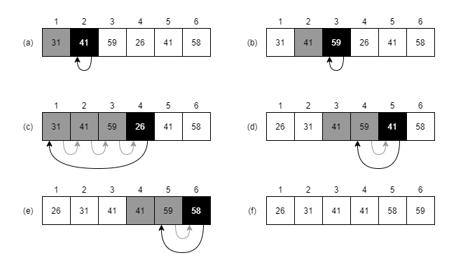

# Exercise Solutions Chapter 2

## 2.1-1

The below figure illustrates the operations of insertion sort on the array A = [31, 41, 59, 26, 41, 58]. A detailed explanation follows after the figure.

The boxes illustrates elements in the array with the content inside the box and the index placed above the box. The sorting is done in six principal steps marked with (a) to (f), with (a) showing the initial ordering and (f) the final sorted array.

In insertion sort so is each element handled one by one, except the first element that do not need to be handled because it will end up at the correct place automatically.

The element that is currently actively worked on being inserted is marked in black. The black element is compared sequentially to elements to the left until the black element is found to be larger or equal to the left element. Elements to the left that are compared in given step are marked in grey.

When the currently correct position for the black active element have been found so is it possibly so that one or more grey elements needs to be shifted right to make space for the black element. The arrows indicates the resulting move of the black element and also the required shifting of grey elements to leave room for he black element.

Lets study step (a) in detail. Here it is time to handle the element at index 2 that holds 41. We compare it to the element at index 1 that holds 31. The order is already correct so no move is needed in step (a).

Move on to study step (b) where the element at index 3 is handled. We have the same situation as in (a) no move is needed.

Move on to study step (c) where the element at index 4 is handled. Here it turns out that all the elements to the left are larger and needs to be shifted to make room for placing the value 26 at the very start of the array.

Step (d) and (e) are similar to what we have already seen an finally in step (f) the array is fully sorted.
